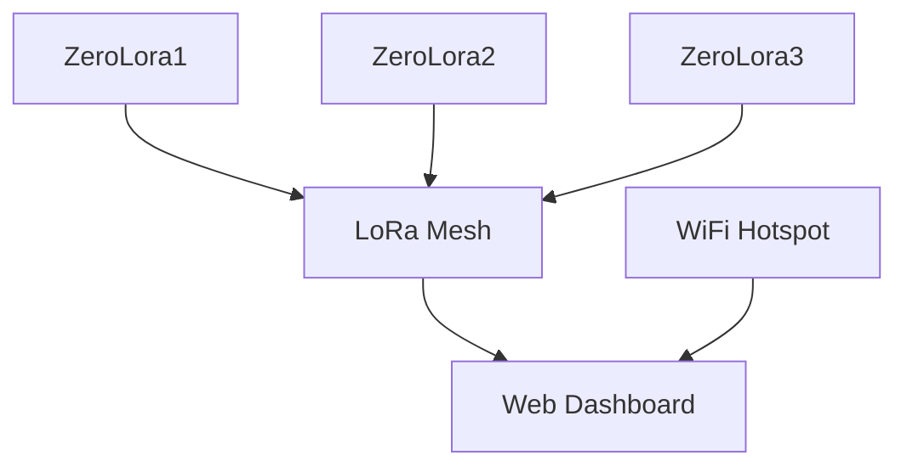

# LoRa Mesh Dashboard

## Übersicht

Ein flexibles LoRa-Mesh-Netzwerk mit Web-Dashboard für Raspberry Pi. Jeder Node kann als Hotspot oder Client betrieben werden und erhält automatisch einen eigenen Hostnamen (z.B. ZeroLora1, ZeroLora2). Das Dashboard zeigt alle verbundenen Geräte und ermöglicht Messaging.

## Features
- Automatische Node-ID und Hostname-Vergabe
- Flask-Dashboard mit Geräteübersicht und Chat
- Raspberry Pi als WiFi-Hotspot oder Client
- Modularer Aufbau (Python)
- Dark Mode Dashboard
- Einfache Erweiterbarkeit für weitere Nodes

## Schnellstart

### Installation (Raspberry Pi)

**Voraussetzung:**
- `git` und `screen` müssen installiert sein:

```bash
sudo apt-get update && sudo apt-get install -y git screen
```

### One-liner Installation (alles in einem Schritt):
```bash
sudo apt-get update && sudo apt-get install -y git screen && git clone https://github.com/ZeroTw0016/LoRa-Test.git && cd LoRa-Test && sudo screen bash setup_wifi_ap.sh && sudo reboot
```

- Nach dem Reboot: Mit dem Hotspot `ZeroLora` verbinden (Passwort: `loramesh123`).
- Dashboard im Browser öffnen: http://ZeroLora1:5000 (oder ZeroLora2 etc.)

### Eigener Hotspot oder Client
- Das System erkennt automatisch, ob es im Hotspot-Modus oder als Client läuft.
- Dashboard startet immer und ist über den Hostnamen erreichbar.

## Systemarchitektur



## Konfiguration & Anpassung
- SSID und Passwort im `setup_wifi_ap.sh` ändern
- Node-Hostnamen werden automatisch vergeben (ZeroLoraX)
- Weitere Nodes einfach durch Kopieren und Starten auf anderen Pis
- Dashboard immer unter http://ZeroLoraX:5000 erreichbar

## Troubleshooting
- Raspberry Pi OS wird benötigt (wegen RPi.GPIO)
- LoRa-Modul korrekt verkabeln (Serial & GPIO)
- Bei Problemen mit dem Hotspot: `/etc/wpa_supplicant/wpa_supplicant.conf.bak` zurückkopieren und rebooten
- Dashboard-Service prüfen: `systemctl status lora_mesh_dashboard.service`
- Für manuelle Tests: Nutze `screen` für serielle Kommunikation (`screen /dev/ttyS0 9600`)

## Kontakt & Support

Fragen, Fehler oder Feature-Wünsche? Öffne ein Issue auf GitHub oder kontaktiere den Maintainer.
